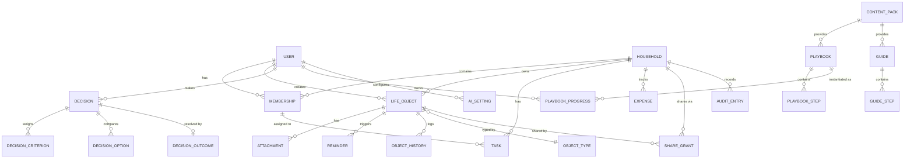

# Life OS — Доменная модель и схема БД

> Единая модель без дублирования сущностей между модулями. Все таблицы несут sync-метаданные (ADR 0003).

## 1. Соглашения (для всех таблиц)
- Первичный ключ: `id UUID` (UUIDv7 — сортируемый по времени, безопасен при офлайн-создании).
- Sync-метаданные: `created_at`, `updated_at`, `hlc` (hybrid logical clock), `deleted_at` (tombstone),
  `version INT`.
- Мультиарендность/изоляция: почти каждая пользовательская запись принадлежит `household_id` (контур)
  и/или `owner_user_id`. PostgreSQL **Row-Level Security** фильтрует по членству и правам.
- Шифрование чувствительных полей — на уровне приложения перед записью (см. SECURITY.md); в БД такие
  поля — зашифрованный blob + метаданные ключа.

## 2. ER-диаграмма (ядро + модули)

## 3. Ключевые сущности

### IAM
- **USER** — `id`, `email`, `password_hash` (argon2id), `mfa_type` (none/totp/passkey), `mfa_secret`
  (зашифрован), `locale`, `status`, `created_at`, ...
- **SESSION** — `id`, `user_id`, `device_id`, `refresh_token_hash`, `expires_at`, `revoked_at`,
  `last_seen_at`, `ip_hash`, `user_agent`.
- **AI_SETTING** — `user_id`, `ai_global_enabled` (bool), `per_module` (jsonb: ledger/household/...),
  `provider`, `privacy_share_sensitive` (bool, default false).

### Household OS
- **HOUSEHOLD** — `id`, `name`, `created_by`, ...
- **MEMBERSHIP** — `id`, `household_id`, `user_id`, `role` (owner/adult/child/guest),
  `permissions` (jsonb override), `expires_at` (для гостя), `status`.
- **SHARE_GRANT** — row-level шаринг: `id`, `household_id`, `resource_type`, `resource_id`,
  `grantee_membership_id` (или весь household), `access_level` (view/edit/manage), `expires_at`.
- **TASK** — `id`, `household_id`, `title`, `assignee_membership_id`, `due_at`, `recurrence`,
  `status`, `linked_object_id?`.
- **EXPENSE** — `id`, `household_id`, `amount`(зашифр.), `currency`, `paid_by_membership_id`,
  `split` (jsonb доли), `category`, `occurred_at`.
- **AUDIT_ENTRY** — `id`, `household_id`, `actor_user_id`, `action`, `resource_type`, `resource_id`,
  `at`, `context` (jsonb, без чувствительного содержимого).

### Life Ledger (ядро)
- **OBJECT_TYPE** — справочник типов: document / warranty_item / subscription / insurance / property /
  vehicle / health_record / financial_obligation. Расширяемо; часть типов приходит из content pack
  (справочники региона).
- **LIFE_OBJECT** — `id`, `household_id`, `owner_user_id`, `type_id`, `title`,
  `data` (jsonb по схеме типа; чувствительные поля зашифрованы), `status`,
  `valid_from`, `valid_until`/`deadline`, `sensitivity` (normal/sensitive/high), sync-метаданные.
- **ATTACHMENT** — `id`, `object_id`, `filename`, `content_type`, `size`, `storage_key`,
  `encryption_key_id`, `scan_status` (pending/clean/blocked), `checksum`.
- **REMINDER** — `id`, `object_id`, `rule` (напр. «за 30/7/1 день до deadline»), `channel`,
  `next_fire_at`, `status`. **Считается правилами, без ИИ.**
- **OBJECT_HISTORY** — неизменяемый журнал изменений объекта: `id`, `object_id`, `actor_user_id`,
  `change` (jsonb diff), `at`.

### Decision Companion
- **DECISION** — `id`, `owner_user_id`, `title`, `context`, `status`, `decided_at?`.
- **DECISION_CRITERION** — `id`, `decision_id`, `label`, `weight`.
- **DECISION_OPTION** — `id`, `decision_id`, `label`, `scores` (jsonb: criterion_id→score), `pros`, `cons`.
- **DECISION_OUTCOME** — `id`, `decision_id`, `chosen_option_id`, `expected`, `actual?`,
  `reviewed_at?` — для анализа паттернов со временем.

### Content Pack Engine (данные пака — версионируются отдельно)
- **CONTENT_PACK** — `pack_id`, `version`, `region`, `locales`, `checksum`, `status`.
- **PLAYBOOK** (Crisis) — `id`, `pack_id`, `pack_version`, `key`, `title_i18n`, `applies_when` (jsonb).
- **PLAYBOOK_STEP** — `id`, `playbook_id`, `order`, `title_i18n`, `description_i18n`,
  `required_document_types` (jsonb, абстрактные типы), `references` (инстанции/ссылки), `embeds_guide?`.
- **GUIDE** (Bureaucracy) — `id`, `pack_id`, `pack_version`, `key`, `title_i18n`, `deadlines`.
- **GUIDE_STEP** — `id`, `guide_id`, `order`, `title_i18n`, `required_document_types`, `status_model`.
- **PLAYBOOK_PROGRESS** — прогресс пользователя: `id`, `user_id`/`household_id`, `playbook_id`,
  `pack_version`, `step_states` (jsonb), `started_at`, `completed_at?`. (Аналогично GUIDE_PROGRESS.)

### Billing (заглушка, вне core — ADR монетизации)
- **DONATION_INTENT** — `id`, `user_id`, `amount`, `status`, `provider_ref?`. Изолирован, не влияет на core.

## 4. Row-Level Security (набросок политик)
- `LIFE_OBJECT`: видим, если `owner_user_id = current_user` **ИЛИ** есть `SHARE_GRANT`/членство в
  `household_id` с достаточным `access_level`. Дети/гости — только явно расшаренное.
- `AUDIT_ENTRY`: доступ только owner/adult дома; запись — системная, не редактируется.
- `DECISION`: приватно владельцу, если явно не расшарено.
- Политики применяются в БД (RLS), а не только в API — защита от broken access control.

## 5. Замечания по эволюции
- Все типы объектов расширяются через `OBJECT_TYPE` + схему `data` — новый тип не меняет структуру таблиц.
- Новый регион = новый `CONTENT_PACK`, без DDL-изменений ядра.
